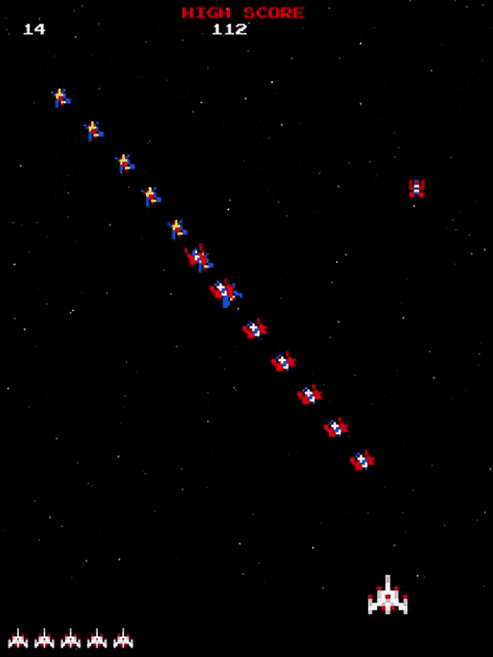

# Galaga
Galaga is a 1981 fixed shooter arcade game developed and published by Namco. In North America, it was released by Midway Games. Controlling a starship, the player is tasked with destroying the Galaga forces in each stage while avoiding enemies and projectiles.

